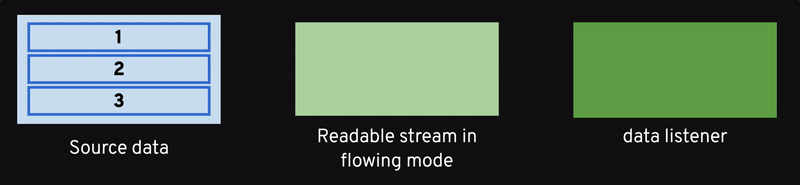
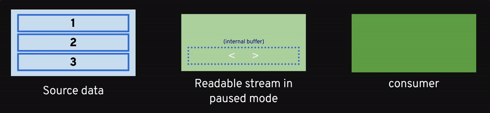

# 02 - Readable Streams

- [02.1 What is a Readable stream](#021-what-is-a-readable-stream)
- [02.2 Flowing mode](#022-flowing-mode)
- [02.3 Paused mode](#023-paused-mode)
- [02.4 Mode switch conditions](#024-mode-switch-conditions)
- [02.5 Readable streams are async iterators](#025-readable-streams-are-async-iterators)
- [02.6 Summary](#026-summary)


## 02.1 What is a Readable stream

A readable stream represents a source from which data is consumed. In a way, you can see Readable streams as an abstraction to consume some input.

Some common examples of Readable streams are the following:

- Read a file from the filesystem: `fs.createReadStream`
- Command line standard input: `process.stdin`
- An HTTP response (received by a client)
- An HTTP request (received by a server)
- AWS S3 `GetObject` (`data` field)

Readable streams support two modes for data consumption: **flowing** and **paused** (or **non-flowing**) mode.


## 02.2 Flowing mode

When using flowing mode, the data is read from source automatically and chunks are emitted as soon as they are available.



- A Readable stream instance is automatically switched to flowing mode as soon as a listener for the `data` event is attached.
- At that point, every single time there's some data available a `data` event is emitted.
- When no more data is available, the `end` event is emitted.

In this example, we use flowing mode to consume data from a file and count the number of emojis:

```javascript
// count-emoji-flowing.js

const { createReadStream } = require('fs')
const { EMOJI_MAP } = require('emoji') // from npm

const emojis = Object.keys(EMOJI_MAP)

const file = createReadStream(process.argv[2])
let counter = 0

file.on('data', chunk => {
  for (let char of chunk.toString('utf8')) {
    if (emojis.includes(char)) {
      counter++
    }
  }
})

file.on('end', () => console.log(`Found ${counter} emojis`))

file.on('error', err => console.error(`Error reading file: ${err}`))
```

> **🎭 PLAY**  
> Play with this script a bit and try to run it against some of the emoji art files available in the [`assets`](/assets) folder.


## 02.3 Paused mode

When using paused mode on a Readable stream, a consumer has to call the `read` method explicitly to read chunks of data from the stream. The stream emits a `readable` event to signal that new data is available and that `read()` should be called to read the data.



With this approach the data is not automatically pushed to the consumer, but only a signal that the data is available is sent. It is up to the consumer to call `read()` to get the data currently stored in the stream internal buffer. If there's no more data in the internal buffer a call to `read()` will return `null`. Also in this mode, once all the data has been read, `end` is emitted.

Let's see how to rewrite the previous example in paused mode:

```javascript
// count-emoji-paused.js

const { createReadStream } = require('fs')
const { EMOJI_MAP } = require('emoji') // from npm

const emojis = Object.keys(EMOJI_MAP)

const file = createReadStream(process.argv[2])
let counter = 0

file.on('readable', () => {
  let chunk
  while ((chunk = file.read()) !== null) {
    for (let char of chunk.toString('utf8')) {
      if (emojis.includes(char)) {
        counter++
      }
    }
  }
})

file.on('end', () => console.log(`Found ${counter} emojis`))

file.on('error', err => console.error(`Error reading file: ${err}`))
```

> **🎭 PLAY**  
> Play with this script a bit and try to run it against some of the emoji art files available in the [`assets`](/assets) folder. You should see the same results as before!


## 02.4 Mode switch conditions

These conditions will help you to understand better how Readable streams are initialized and which mode is being used:

- All Readable streams are created in **paused** mode
- Paused streams can be switched to **flowing** mode with:
  - `stream.on('data', () => {})`
  - `stream.resume()`
  - `stream.pipe()`
- Flowing streams can switch back to **paused** with:
  - `stream.pause()`
  - `stream.unpipe()` on all attached streams

Don't worry to much about `.pipe` for now as we will explore that later.

Modes are just a convention to consume data, both are substantially equivalent and you might prefer either one or another. My advice is to pick one and stay consistent, but also not to mix the two modes while consuming from a given stream.

If you want another view on **flowing** VS **paused** mode:

 - *Push* (flowing) VS *Pull* (paused) mental models
 - Flowing is simpler to use
 - Paused mode gives you more control on how and when data is consumed from the source (might be good when it's expensive to read data from source)


## 02.5 Readable streams are async iterators

Readable streams are async iterators (since Node.js version 10), so we can consume data from a readable stream with the `for await of` syntax:

```javascript
async function consumeStreamData(stream) {
  for await (let chunk of stream) {
    console.log(chunk)
  }
}
```

With this in mind we can rewrite our previous example as follows:

```javascript
// count-emoji-async-iterator.js

const { createReadStream } = require('fs')
const { EMOJI_MAP } = require('emoji') // from npm

async function main () {
  const emojis = Object.keys(EMOJI_MAP)
  const file = createReadStream(process.argv[2])
  let counter = 0

  for await (let chunk of file) {
    for (let char of chunk.toString('utf8')) {
      if (emojis.includes(char)) {
        counter++
      }
    }
  }

  console.log(`Found ${counter} emojis`)
}

main()
```

> **🎭 PLAY**  
> Play with this script a bit and try to run it against some of the emoji art files available in the [`assets`](/assets) folder. Again, you should see the same results as before!

> **🏹 Exercise** ([count-words.js](/02-readable-streams/exercises/count-words.js))
>
> Write a function that receives a text stream and counts the total number of words in the stream.
>
> A skeleton of the file is available at `02-readable-streams/exercises/count-words.js`.
>
> You can edit the file and run an interactive test session to validate your implementation with:
>
> ```bash
> npm test -- 02-readable-streams/exercises/count-words.test.js
> ```
>
> If you really struggle with this, you can have a look at [`count-words.solution.js`](/02-readable-streams/exercises/count-words.solution.js) for a possible solution.


## 02.6 Summary

At this point you should be familiar with Readable streams and the different modes you can use to consume their data.

Get ready to move to the [Next section](/03-writable-streams/README.md) where we are going to explore Writable streams!


---

| [⬅️ 01 - Buffer vs Stream](/01-buffer-vs-stream/README.md) | [🏠](/README.md)| [03 - Writable Streams ➡️](/03-writable-streams/README.md)|
|:--------------|:------:|------------------------------------------------:|
