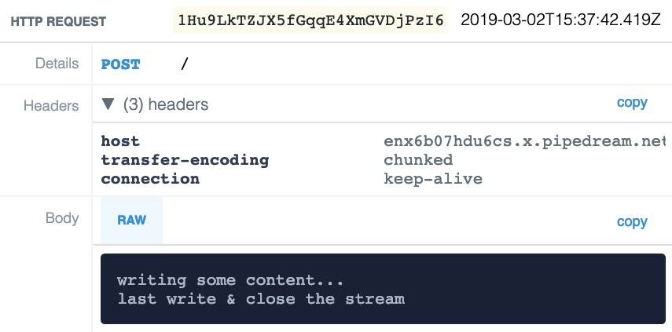

# 03 - Writable Streams

- [03.1 What is a Writable stream](#031-what-is-a-writable-stream)
- [03.2 Using Writable streams](#032-using-writable-streams)
- [03.3 Backpressure](#033-backpressure)
- [03.4 Summary](#034-summary)


## 03.1 What is a Writable stream

A Writable stream is an abstraction that allows to write data over a destination. In a way you can see Writable streams as an abstraction for output.

Some notable instances of Writable streams:

- Writing to a file with `fs.createWriteStream()`
- Command line standard output and standard error (`process.stdout`, `process.stderr`)
- An HTTP request (when sent by a client)
- An HTTP response (when sent by a server)
- AWS S3 `PutObject` (`body` parameter)


## 03.2 Using Writable streams

Let's try to use a Writable stream to send an HTTP request to a server. We are not going to use any third party HTTP library, we will rely on the native Node.js `http` module.

```javascript
// writable-http-request.js

const http = require('http')

const req = http.request(
  {
    hostname: 'enx6b07hdu6cs.x.pipedream.net',
    method: 'POST'
  },
  (resp) => {
    console.log(`Server responded with "${resp.statusCode}"`)
  }
)

req.on('finish', () => console.log('request sent'))
req.on('close', () => console.log('Connection closed'))
req.on('error', err => console.error(`Request failed: ${err}`))

req.write('writing some content...\n')
req.end('last write & close the stream')
```

When we use `http.request()` we get back a request object. This object is a Writable stream.

We can attach event listeners like `finish` (when the request is fully sent), `close` (when the connection with the server is closed), `error` (to catch any error).

In order to write content to the server through the request object we can invoke `write(data)` and `end(data)`.

These two methods from writable streams allows to write data over the destination. The data can be a `string` or a `Buffer`.

When using `end(data)`, the connection with the destination will be closed after the write is completed, so it is generally used to write the last chunk of data. You can also call `end()` without any `data` argument if you want to just close the stream without writing more data.

If you run the previous snippet of code, you should see the following output on the client:

```plain
Request sent
Server responded with "200"
Connection closed
```

This is instead what the server will receive:



You can see that the payload of the received request contains:

```plain
writing some content...
last write & close the stream
```

> **🎭 PLAY**  
> Get a new server sandbox URL on [requestbin.com/](https://requestbin.com/), update the code with the new endpoint and try to run some requests. Inspect the output on the client side and on the server side.

> **🎭 PLAY**
> Try to write a buffer initialized from the following base64 encoded data:
>
> ```plain
> ICgnLS4gLi0uICAgKCctLgooIE9PICkgIC8gXyggIE9PKQosLS0uICwtLS4oLC0tLS0tLS4sLS0uICAgICAgLC0tLiAgICAgIC4tJyksLS0tLS0uCnwgIHwgfCAgfCB8ICAuLS0tJ3wgIHwuLScpICB8ICB8Li0nKSAoIE9PJyAgLi0uICAnCnwgICAufCAgfCB8ICB8ICAgIHwgIHwgT08gKSB8ICB8IE9PICkvICAgfCAgfCB8ICB8CnwgICAgICAgfCh8ICAnLS0uIHwgIHxgLScgfCB8ICB8YC0nIHxfKSAgfCAgfCB8ICB8CnwgIC4tLiAgfCB8ICAuLS0nKHwgICctLS0uJyh8ICAnLS0tLicgICAgfCAgfCB8ICB8CnwgIHwgfCAgfCB8ICBgLS0tLnwgICAgICB8ICB8ICAgICAgfCAgICBgJyAgJy0nICAnCmAtLScgYC0tJyBgLS0tLS0tJ2AtLS0tLS0nICBgLS0tLS0tJyAgICAgIGAtLS0tLScK
> ```
>
> What are you seeing as a request body on the request bin page? :)


## 03.3 Backpressure

A Writable stream is an abstraction that allows you to write data over a destination, we should know that by now.

Imagine you are using a filesystem Writable stream to write data onto a disk. Every single time you call `.write(data)` on the stream instance, `data` is copied into a buffer in memory and the stream implementation will try to flush that information into disk as soon as possible.

If you are writing data very fast, the disk won't probably be able to keep up and the actual buffered data will grow. If this keeps happening you will easily fill all the memory and end up with the same problem we saw in the first chapter, where we reach the maximum size of a buffer. At that point, our application will crash with an exception!

To give you a better example on a case where this might happen, let's go back to our copy file example we saw in chapter 1.

If we copy a large file from a very fast disk like an SSD drive to a much slower one like a magnetic spinning disk or a network drive, it's very likely we will be able to read very fast and try to write at the same speed. The writable stream will keep accumulating data to the point where it will crash!

This problem is called **backpressure** as it reminds fluid dynamics where you have to be careful on how much pressure you exert to push a fluid down a pipe, to make sure it goes at the desired speed.

Remember when we said that the streaming implementation of our file copy script was not perfect. Well this is why, it was not taking backpressure into account!

Thankfully, Node.js Writable stream APIs can help us to handle backpressure properly.

In fact, every single time we call `.write(data)` on a stream, the stream will return a `boolean` value. If this value is `true` it means that it is safe to continue, if the value is `false` it means that the destination is lagging behind and the stream is accumulating too much data to write. In this last case, when you receive `false`, you should slow down, or even better stop writing until all the buffered data is written down.

But how do we know when it's ok to write again? A writable stream will emit a `drain` event once all the buffered data has been flushed and it's safe to write again. So with this in mind, handling backpressure properly looks more or less like this:

```javascript
function backpressureAwareCopy(srcStream, destStream) {
  srcStream.on('data', (chunk) => {
    const canContinue = destStream.write
    if (!canContinue) {
      // if we are overflowing the destination, we stop reading
      srcStream.pause()
      // once all the buffered data is flushed, we resume reading from source
      destStream.once('drain', () => srcStream.resume())
    }
  })
}
```

Notice that we are using `.once` instead of `.on`, because we want to listen only once for the `drain` event. Every single time we are handling backpressure the listener for `drain` is re-created and automatically removed after the event is handled.

With this in mind we can rewrite our stream copy script to handle backpressure:

```javascript
// stream-copy-safe.js

const { createReadStream, createWriteStream } = require('fs')

const [, , src, dest] = process.argv
const srcStream = createReadStream(src)
const destStream = createWriteStream(dest)

srcStream.on('data', data => {
  const canContinue = destStream.write(data)
  if (!canContinue) {
    // we are overflowing the destination, we should pause
    srcStream.pause()
    // we will resume when the destination stream is drained
    destStream.once('drain', () => srcStream.resume())
  }
})
```

This implementation is much better than the previous one! 👍


## 03.4 Summary

At this point you should be familiar with the basic concepts related to Writable streams: what are the most common usages of Writable streams, how to write data, how to close the stream and how to handle back pressure.

Take a deep breath and get ready to move into one of my favourite stream topics: [Transform streams](/04-transform-streams/README.md)! ✌️

---

| [⬅️ 02 - Readable streams](/02-readable-streams/README.md) | [🏠](/README.md)| [04 - Transform Streams ➡️](/04-transform-streams/README.md)|
|:--------------|:------:|------------------------------------------------:|
