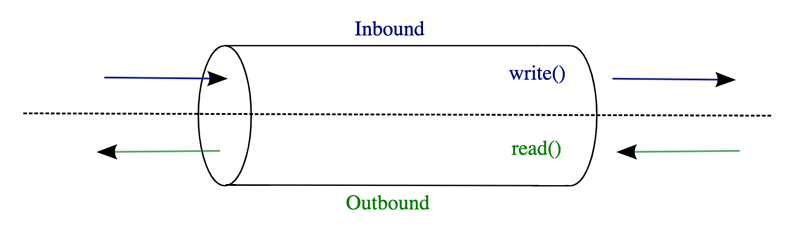
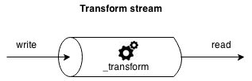
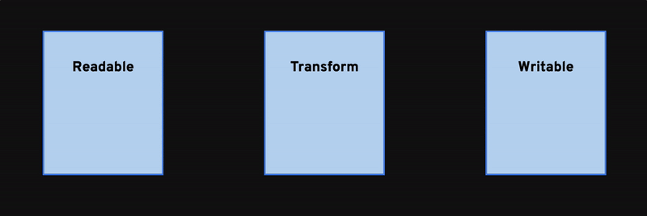

# 04 - Transform Streams

- [04.1 Duplex and Transform streams](#041-duplex-and-transform-streams)
- [04.2 Using Transform streams](#042-using-transform-streams)
- [04.X Summary](#04X-summary)

## 04.1 Duplex and Transform streams

Readable and Writable streams are not the only options when it comes to streaming in Node.js.

Another important type of stream is the **Duplex** stream.

A Duplex stream is essentially a stream that is both Readable and Writable. It is an ideal abstraction to represent readable and writable pipes like TCP connections.

**Transform** streams are a special class of Duplex streams in which the data that is written in one end of the stream is internally modified so that it can be read in its new form on the other end. This essentially a way to be able to do in flight transformations and it's very useful in multiple cases:

 - Compression / Decompression
 - Encryption / Decryption
 - Data filtering
 - Data enrichment
 - Media transcoding

It might be easier to appreciate this idea with an animated image:

Of course consider that this is done continuously on every chunk, so the flux of data is constantly transformed as more data arrives.

## 04.2 Using Transform streams

A very good example for Transform streams is gzipping. Imagine we want to convert our copy file utility into an "archive" file utility, where, in order to save space, the file gets compressed while copied to the end destination.

How could we do that?

Well at this point this is what we know:

 - Transform streams are both Readable and Writable
 - We know how to use Readable and Writable streams through events

So given a source stream and a destination stream we should be able to write a copy and gzip script, right?

Ok, before trying to write any code, let's try to visualize the problem for a moment and understand what kind of events we have to deal with and how should we tie all of them together:

...

## 04.X Summary

...

---

| [⬅️ 03 - Writable streams](/03-writable-streams/README.md) | [🏠](/README.md)| [05 - Pipes ➡️](/05-pipes/README.md)|
|:--------------|:------:|------------------------------------------------:|
