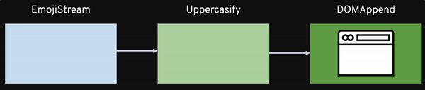
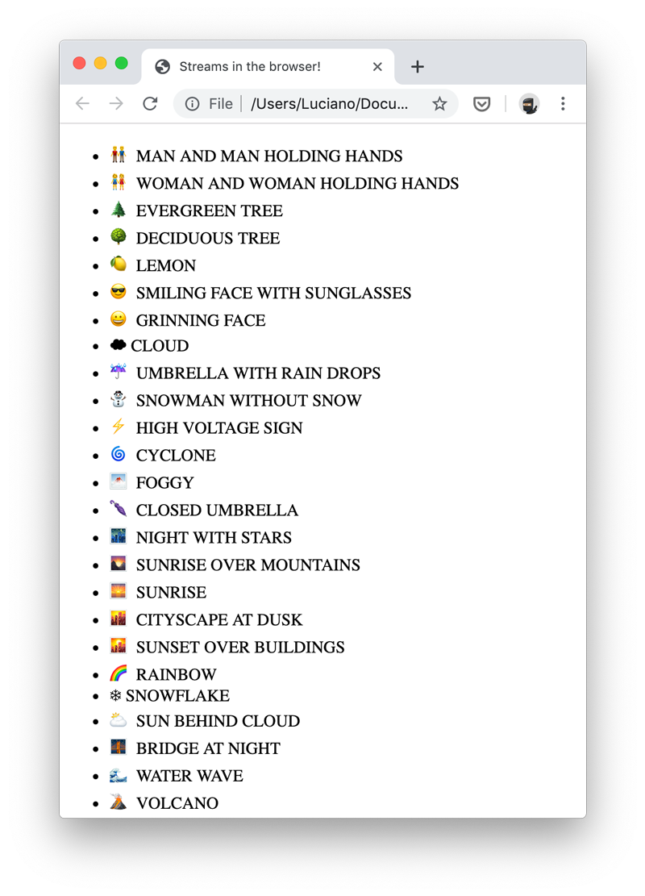

# 07 - Streams in the browser

- [07.1 Let's stream Emojis to the browser](#071-lets-stream-emojis-to-the-browser)
- [07.2 Bundling with Webpack](#072-bundling-with-webpack)
- [07.3 The HTML wrapper](#073-the-html-wrapper)
- [07.4 Conclusion](#074-conclusion)


## 07.1 Let's stream Emojis to the browser

In the previous section we saw how to create a stream of Emojis, an uppercasify stream and even a Writable stream that allows us to attach data to the DOM of a web page runnign in a browser.

If we combine these 3 pieces we could build an browser application that displays Emojis and their description in the browser.

The idea is to build something like this:



Ok, since we already have all the streams in place, this is just a matter of piping them together:

```javascript
// emoji-list.js

const { pipeline } = require('readable-stream')
const EmojiStream = require('../06-custom-streams/emoji-stream')
const Uppercasify = require('../06-custom-streams/uppercasify')
const DOMAppend = require('../06-custom-streams/dom-append')

pipeline(
  new EmojiStream(),
  new Uppercasify(),
  new DOMAppend(),
  (err) => {
    if (err) {
      console.error(err)
    }
  }
)
```

This should make some sense at this point of the workshop. But, you are now properly wondering, how do we run this? We need a browser to run this code. If we just run it with Node.js we get back the following error:

```plain
.../streams-workshop/06-custom-streams/dom-append.js:7
    const elem = document.createElement('li')
                 ^

ReferenceError: document is not defined
```

And this is obviously because Node.js doesn't have the DOM so it doesn't have the global `document` object.

On the other hand, we can't just run the same code in the browser through a `<script>` tag as it will give us the following runtime error:

```plain
Uncaught ReferenceError: require is not defined
    at emoji-list.js:3
```

This is because in the browser we don't have `require`.

How do we fix this?

Welcome to module bundlers!


## 07.2 Bundling with Webpack

Module bundlers try to bridge the gap between server side code and browser side code.

They take code written using module systems like CommonJS, reconstruct the depency graph of the file, and transform the code into equivalent code that can run in the browser (generally in a single file).

Here we are going to use Webpack as a module bundler.

So, assuming yoy have `webpack` and `webpack-cli` installed from NPM, this is how we are going to compile our `emoji-list.js` script into something that can work in the browser:

```bash
node_modules/.bin/webpack 07-streams-in-the-browser/emoji-list.js --output-path 07-streams-in-the-browser/dist
```

Now you should have a new file called `dist/main.js`. This file is the equivalent of `emoji-list` (including its dependencies), but it works on the browser.


## 07.3 The HTML wrapper


One last thing that we need to is creating an HTML page that hosts our frontend app, we will call it `index.html`:

```html
<!DOCTYPE html>
<html lang="en">
  <head>
    <meta charset="utf-8" />
    <meta
      name="viewport"
      content="width=device-width,initial-scale=1,shrink-to-fit=no"
    />
    <title>Streams in the browser!</title>
  </head>
  <body>
    <ul id="list"></ul>
    <script src="dist/main.js"></script>
  </body>
</html>
```

The only relevant details here are:

 - `<ul id="list"></ul>`: this is the DOM element that will contain our streamed elements. Go check out again the code from our `DOMAppend` stream and you will notice that we hardcoded the stream to always write data to an element with id `list`.
 - `<script src="dist/main.js"></script>`: this is where we actually include the bundled script

At this point you can open the HTML file with any modern browser and you should see our list of emojis! Hooray! 🎉



> **🎭 PLAY**  
> Did you notice that the stream is so fast to dump all the emojis that we don't even notice that JavaScript is streaming them?
>
> We could make the streaming a bit more apparent by adding a new Transform stream that delays the push of the write of the new chunks. Can you write something like this?


## 07.4 Conclusion

This was just a silly example on how to bring the Node.js stream utilities to the browser, but maybe you can use these ideas for something more interesting.

For instance, i think you could use these ideas in combination with Websockets or maybe even WebRTC to stream data between clients or between a client and a server.

Your imagination is probably the limit.

At this point, you probably learned a lot and you should feel confortable enough using streams in your daily coding challenges.

In the next and last chapter I will propose you some (hopefully) [interesting exercises](/08-projects/README.md) that you can do on your own time to do some more practice on the concepts learned here!


---

| [⬅️ 06 - Custom streams](/06-custom-streams/README.md) | [🏠](/README.md)| [08 - Projects ➡️](/08-projects/README.md)|
|:--------------|:------:|------------------------------------------------:|
