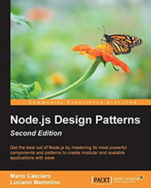

# streams-workshop

A workshop on Node.js Streams

## Prerequisites

Before getting started, make sure you have the following prerequisites in your system:

- Node.js 12.3+
- NPM 6.9.0
- A recent version of Google Chrome
- a text editor of your choice
- a bash-compatible shell

## Getting started

Clone the repository and run `npm install` to get all the necessary dependencies.

The workshop is divided in chapters and the first chapter starts at [`01-buffer-vs-stream`](01-buffer-vs-stream/README.md).

Every chapter will teach you a specific stream concept and offer you some examples and exercises to familiarize with that concept.

You will often find 2 different types of interactive actions:

- **🎭 PLAY** : commands or instructions you should spend some time with to get familiar with some concepts or APIs
- **🏹 Exercise**: when you have to use some of the concepts you just learned to solve a programming problem. Generally every exercise will have a test that you can run to validate your solution.

Some slides will be available to complement the workshop material.

Enjoy! 🙃

[➡️ GET STARTED](01-buffer-vs-stream/README.md).

## Shameless self plug

If you like this work, consider supporting me by getting a copy of [Node.js Design Patterns, Second Edition](http://amzn.to/2bB58Ic), which also goes into great depth about Streams and related design patterns.

Buy on [Amazon.com](http://amzn.to/2bB58Ic) - [Amazon.co.uk](http://amzn.to/2bddyWq) - [Packtpub](https://www.packtpub.com/web-development/nodejs-design-patterns-second-edition) - [O'Reilly](http://shop.oreilly.com/product/9781785885587.do)

## Contributing

Everyone is very welcome to contribute to this project.
You can contribute just by submitting bugs or suggesting improvements by
[opening an issue on GitHub](https://github.com/lmammino/streams-workshop/issues).

## License

Licensed under [MIT License](LICENSE). © Luciano Mammino.
